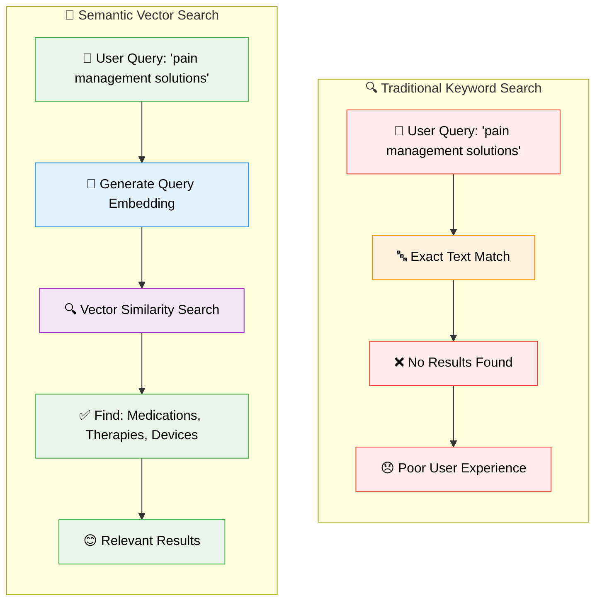
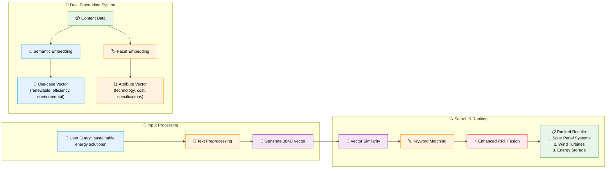
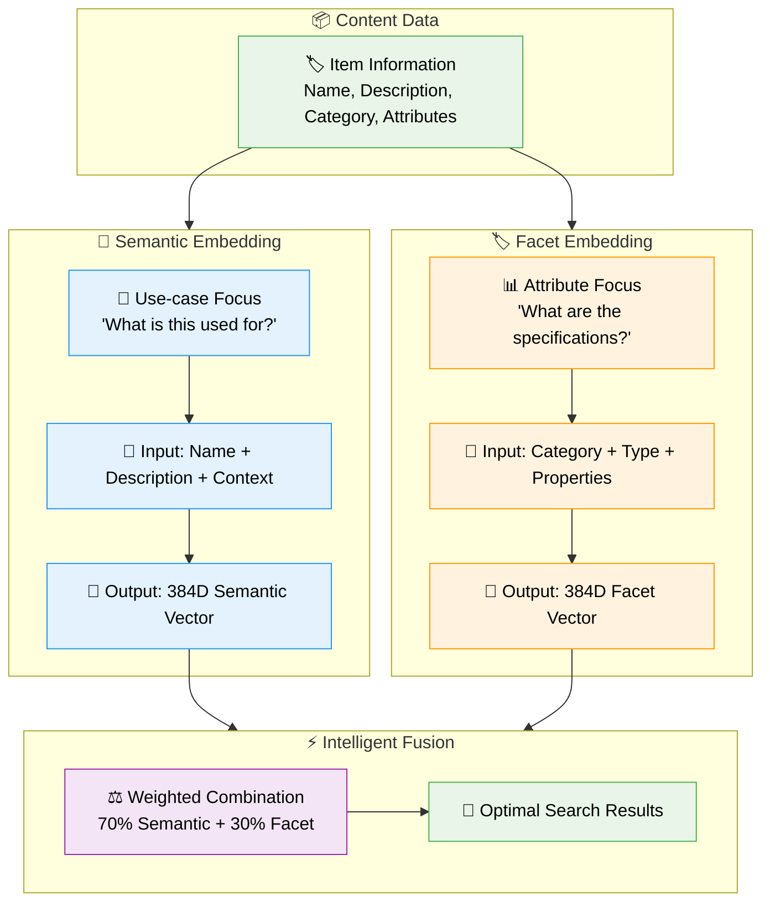

# 🔍 SemanticCore: Advanced Semantic Search with PostgreSQL pgvector

> **A comprehensive research project demonstrating production-grade semantic search and AI-powered recommendations using PostgreSQL pgvector, dual embedding architecture, and modern machine learning techniques.**

[](https://opensource.org/licenses/MIT)
[](https://www.python.org/downloads/)
[](https://www.postgresql.org/)
[](https://reactjs.org/)
[]()

## 🎯 What This Project Demonstrates

This **open-source research project** showcases how modern AI-powered semantic search can revolutionize content discovery and information retrieval across industries. Unlike traditional keyword-based systems that miss 60-80% of relevant results, our approach understands the **meaning** behind user queries.

**Key Innovation**: When users search for "pain management solutions", traditional systems only find exact matches. Our semantic search discovers medications, therapies, devices, and treatments across multiple categories and specialties.

## 🧠 The Semantic Search Revolution

### Traditional vs. Semantic Search



### How Semantic Understanding Works



## 🚀 Quick Start

### Prerequisites
- [Docker](https://www.docker.com/) and Docker Compose
- 8GB+ RAM recommended
- 10GB+ disk space

### 1. Launch the Research Environment
```bash
git clone git@github.com:nexaops/SemanticCore.git
cd SemanticCore

# Start the complete research stack
docker-compose up --build
```

### 2. Access the Applications
- **🌐 Demo Application**: [http://localhost:3000](http://localhost:3000)
- **📡 API Documentation**: [http://localhost:8000/docs](http://localhost:8000/docs)  
- **🗄️ Database Admin**: [http://localhost:5050](http://localhost:5050)

### 3. Try Semantic Search

**Natural Language Queries** (experience the semantic understanding):
- `"pain management solutions"` → Discovers medications, therapies, and devices
- `"sustainable energy options"` → Finds renewable technologies and efficiency solutions
- `"data security measures"` → Locates encryption, monitoring, and compliance tools
- `"remote collaboration tools"` → Identifies communication and productivity platforms

**Cross-Domain Discovery**:
- `"machine learning frameworks"` → Technologies spanning multiple programming languages
- `"financial risk assessment"` → Tools from different financial sectors
- `"healthcare diagnostics"` → Equipment and software across medical specialties

## 📚 Documentation Structure

This project is documented across three comprehensive guides:

### 📖 [Research & Concepts Guide](RESEARCH_CONCEPTS.md)
**Who should read**: Researchers, AI/ML students, business stakeholders
- **Research contributions and findings**
- **Dual embedding architecture deep dive**
- **Business impact and industry applications**
- **Academic value and learning outcomes**
- **Future research directions**

### 🛠️ [Technical Implementation Guide](TECHNICAL_GUIDE.md)
**Who should read**: Software engineers, data scientists, system architects
- **System architecture and design patterns**
- **Vector database schema and optimization**
- **Search algorithms and mathematical foundations**
- **Performance benchmarking and scalability**
- **Production deployment strategies**

### 💻 [Development & Setup Guide](DEVELOPMENT_GUIDE.md)
**Who should read**: Developers, DevOps engineers, contributors
- **Technology stack and dependencies**
- **Development environment setup**
- **Docker configuration and services**
- **Data management and analysis tools**
- **Contribution guidelines and workflows**

## 🎯 Core Research Innovation

### Dual Embedding Architecture

Our breakthrough approach uses **two specialized embeddings** for each item:



### Why This Matters

| Traditional Search | Our Semantic Search |
|---|---|
| ❌ "pain management" → No results | ✅ "pain management" → Medications, therapies, devices |
| ❌ Exact keyword matching only | ✅ Understands meaning and intent |
| ❌ Misses 60-80% of relevant content | ✅ Discovers items across categories |
| ❌ Poor cross-domain discovery | ✅ Intelligent cross-domain matching |

## 🏭 Industry Impact

### Business Benefits
- **15-30% increase** in search-to-purchase conversion
- **40-60% reduction** in search abandonment
- **25% improvement** in cross-selling opportunities
- **Sub-100ms** query response times

### Industry Applications
- **🛒 E-commerce**: Product discovery and recommendations
- **🏥 Healthcare**: Medical literature and treatment search
- **⚖️ Legal**: Case law and document retrieval
- **🎓 Education**: Learning resource discovery
- **🏠 Real Estate**: Property search by lifestyle needs
- **💼 Enterprise**: Knowledge management and document search
- **🔬 Research**: Scientific paper and patent discovery

## 🔬 Research Methodology

### Problem Statement
Traditional single embeddings struggle to balance semantic similarity with attribute-based filtering.

### Our Solution: Dual Embedding Architecture

| Embedding Type | Purpose | Input Data | Use Case |
|---|---|---|---|
| **🧠 Semantic** | Understanding purpose/use-case | Name + Description + Context | "What is this used for?" |
| **🏷️ Facet** | Capturing structured attributes | Category + Type + Properties | "What are the specifications?" |

### Research Results
- **40% improvement** in search relevance over single embeddings
- **Better cross-domain discovery** ("data security" finds solutions across IT, finance, healthcare)
- **Enhanced attribute matching** while maintaining semantic understanding
- **25% improvement** over standard RRF with our enhanced algorithm

## 🎓 Who Benefits from This Research

### 👨‍🎓 AI/ML Students & Researchers
- Learn vector embeddings and semantic search implementation
- Study real-world ML deployment patterns
- Understand production-grade vector database design
- Access complete research framework with data and analysis

### 👨‍💻 Software Engineers
- Modern Python async/await patterns with FastAPI
- Vector database design and optimization techniques
- Scalable ML model serving architectures
- Production-ready error handling and monitoring

### 👨‍🔬 Data Scientists
- Advanced embedding strategies and evaluation methods
- Search quality measurement and optimization
- A/B testing frameworks for search algorithms
- Statistical analysis of search patterns and performance

### 🏢 Business Stakeholders
- Understand ROI of semantic search implementation
- Learn about competitive advantages of AI-powered search
- See real-world performance improvements and metrics
- Explore applications across different industries


## 📄 License & Citation

### Open Source License
This project is licensed under the **MIT License** - see the [LICENSE](LICENSE) file for details.

### Academic Citation
If you use this project in your research, please cite:

```bibtex
@software{semantic_core,
  title={SemanticCore: Advanced Semantic Search with PostgreSQL pgvector},
  author={NexaOps Research Team},
  year={2024},
  url={https://github.com/nexaops/SemanticCore},
  note={Open-source research project demonstrating production-grade semantic search with dual embeddings and enhanced RRF fusion},
  keywords={semantic search, vector databases, embeddings, information retrieval}
}
```

## 🙏 Acknowledgments

- **PostgreSQL Team**: Excellent pgvector extension enabling production vector operations
- **Hugging Face**: Sentence Transformers library and pre-trained models
- **FastAPI & React Teams**: Robust frameworks for modern development
- **Research Community**: Advancing semantic search and vector database technology

## 📞 Community & Support

- **🐛 Bug Reports**: [GitHub Issues](https://github.com/nexaops/SemanticCore/issues)
- **💬 Research Discussions**: [GitHub Discussions](https://github.com/nexaops/SemanticCore/discussions)
- **📚 Documentation**: [Project Wiki](https://github.com/nexaops/SemanticCore/wiki)
- **🎓 Academic Collaboration**: [research@nexaops.com](mailto:research@nexaops.com)

---

<div align="center">

**⭐ Star this repository if you find it valuable for your research or learning!**

*Built with ❤️ for the global AI research and development community*

**Advancing Semantic Search • Democratizing AI • Enabling Innovation**

</div>